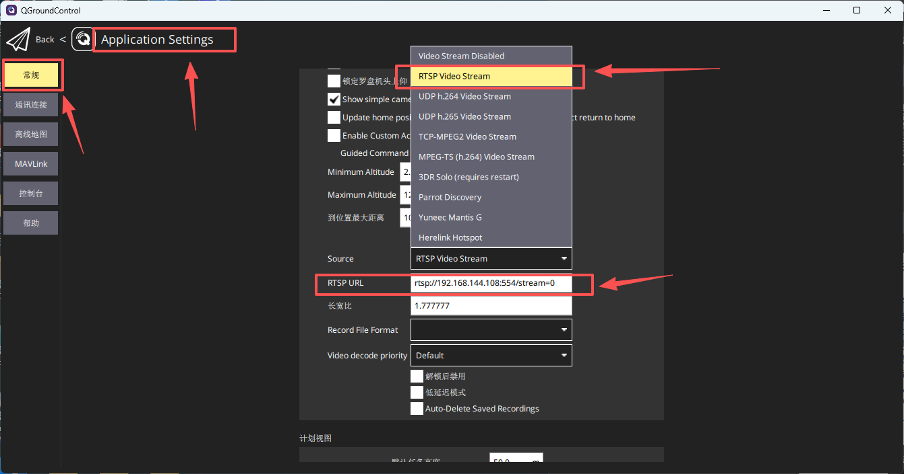
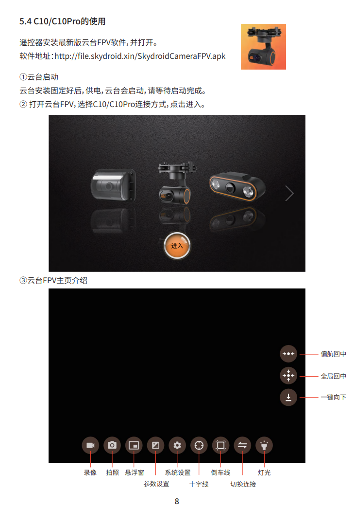

# C10pro吊舱使用

## 基于G12链路的吊舱使用

吊舱产品手册地址，官网在线PDF：[C10pro吊舱产品手册](https://https://www.skydroid.xin/cdn/official-prod/overrides/C10-C10PRO-Instructions.pdf)
吊舱手册pdf：[C10pro](../pdf/C10-C10PRO-Instructions.pdf)

### QGC地面站拉取吊舱视频流

* C10/C10Pro默认视频流地址：rtsp://192.168.144.108:554/stream=0

* 在QGC地面站中添加视频流地址即可查看吊舱视频流（安卓版本QGC同理）

###  吊舱控制

* 需要安装遥控器安装最新版云台FPV软件

* 软件地址：http://file.skydroid.xin/SkydroidCameraFPV.apk

* 软件详细使用参考吊舱产品手册中如下部分

