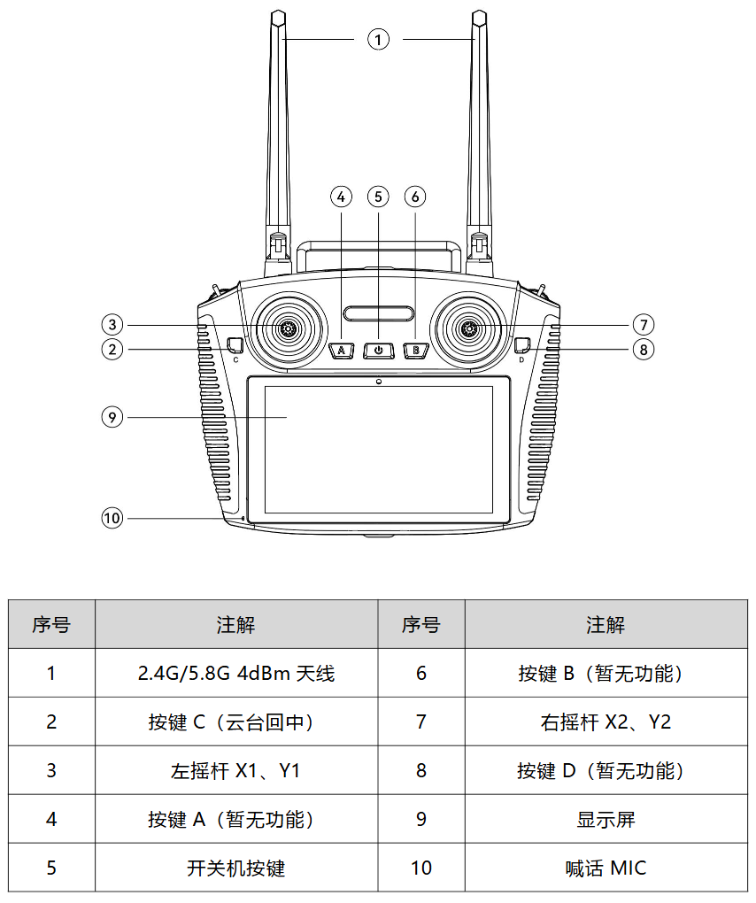
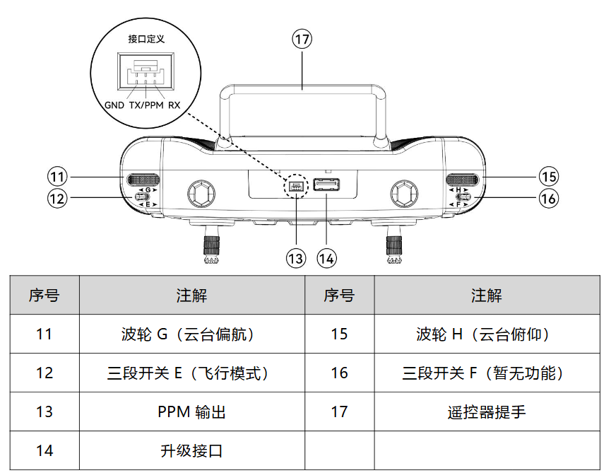
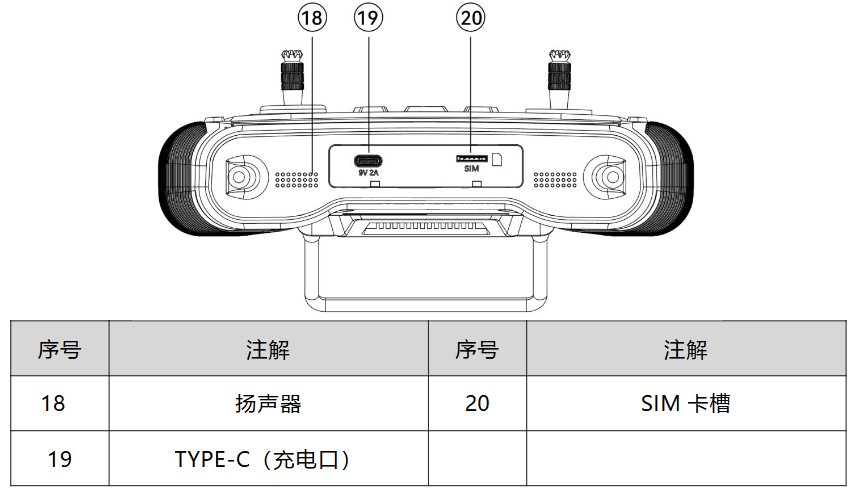
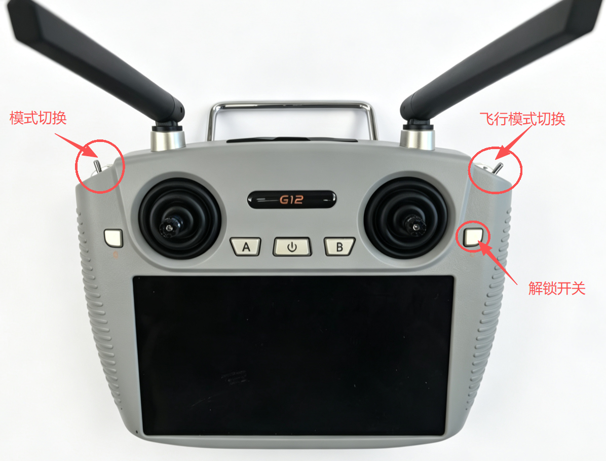

# 准备遥控器

## 遥控器功能







## 拨杆功能设置

遥控器默认为美国手，控制逻辑如下：

*  美国手遥控器控制逻辑示意图
```
┌─────────────────────────────────────────────────┐
│                     遥控器                      │
├─────────────┬───────────────────────────────────┤
│   左摇杆    │               右摇杆              │
├─────────────┼───────────────────────────────────┤
│  ↑ 油门增加 │  ↑       俯仰（机头向下）         │
│  ↓ 油门减少 │  ↓       俯仰（机头向上）         │
│  ← 偏航左转 │  ←          滚转（向左）          │
│  → 偏航右转 │  →          滚转（向右）          │
└─────────────┴───────────────────────────────────┘
```




## 按键功能表

| 按键名称/位置 | 上位 | 中位 | 下位 |
|---------|---------|---------|---------|
| D | 上锁 | 未启用 | 解锁 |
| E| 自稳 | 定点 | 板外 |
| F | 旋翼模式 | 未启用 | 固定翼模式 |


