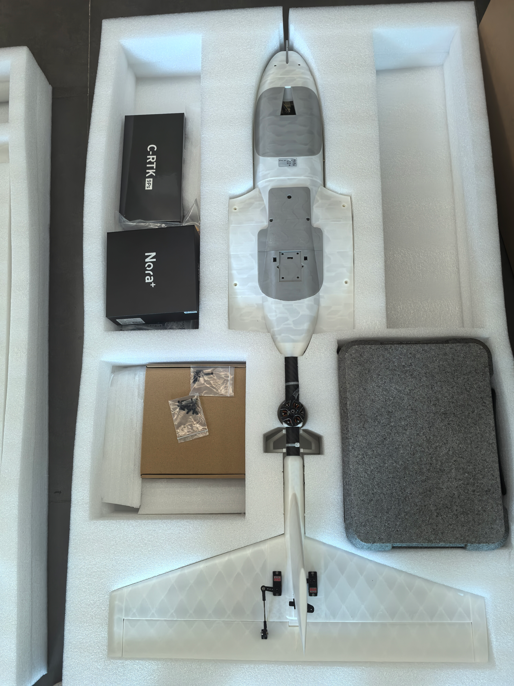
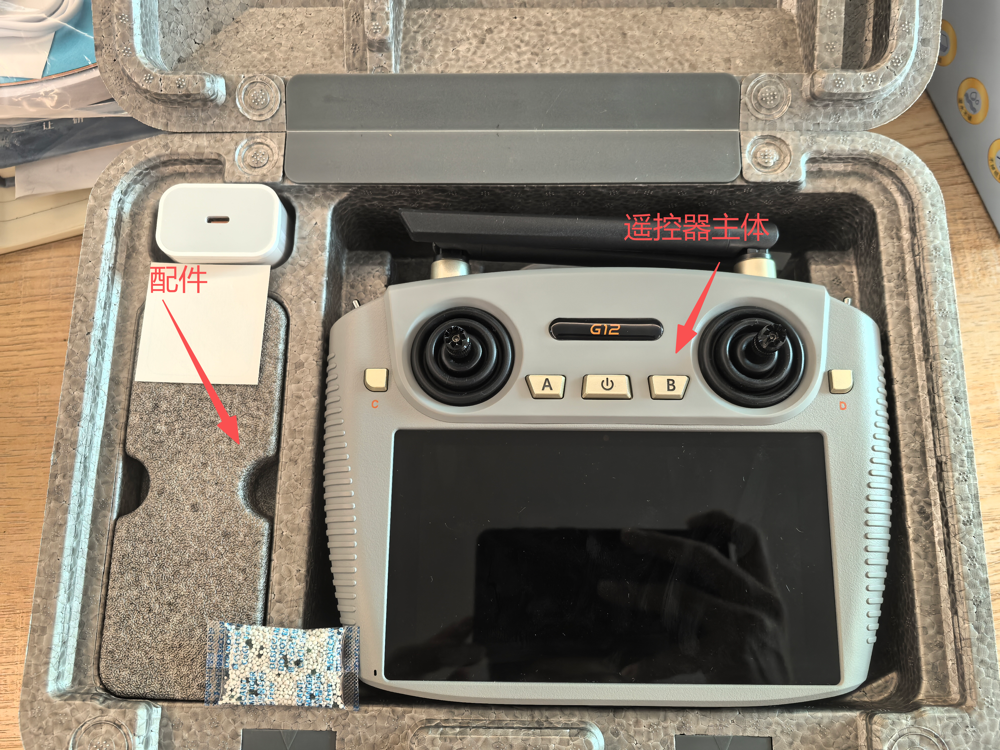
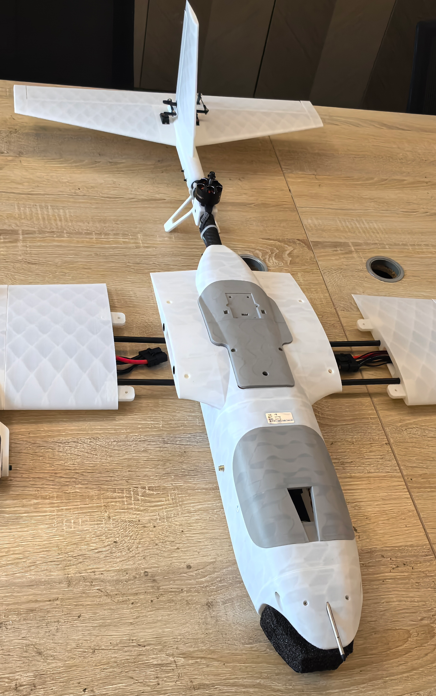
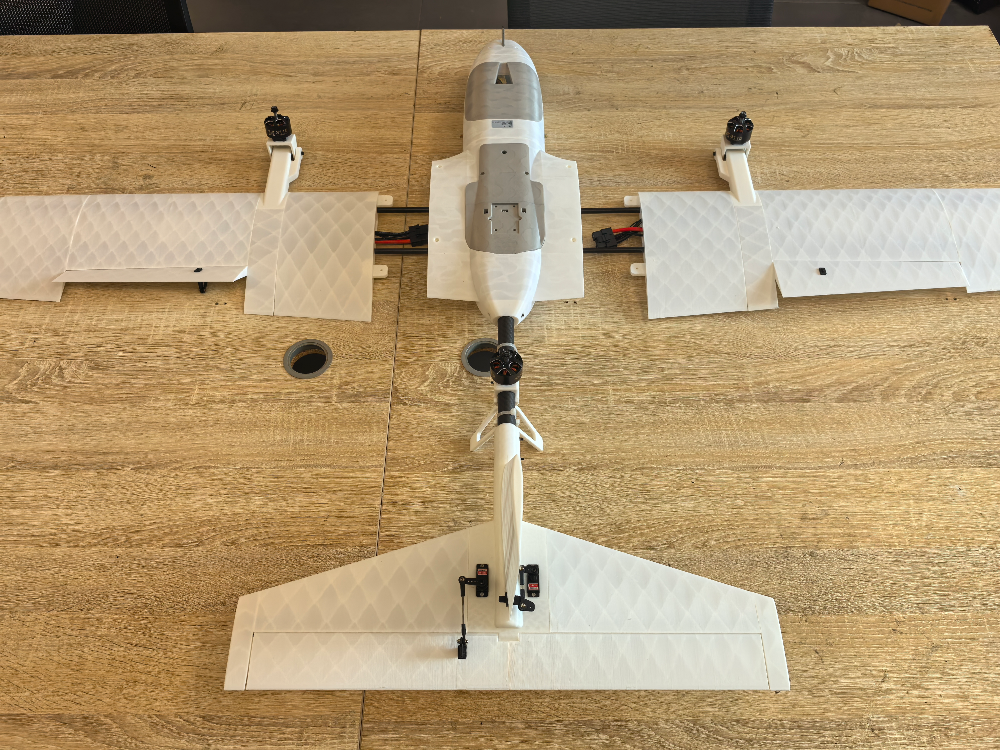
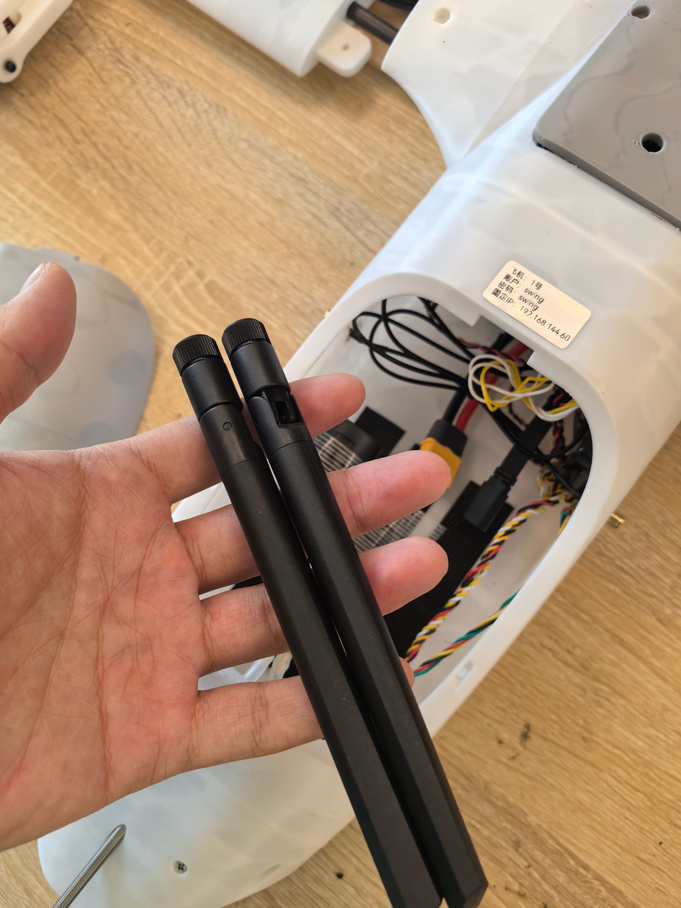
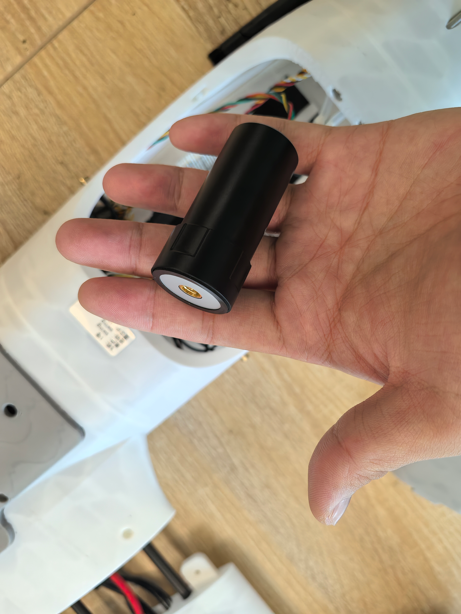
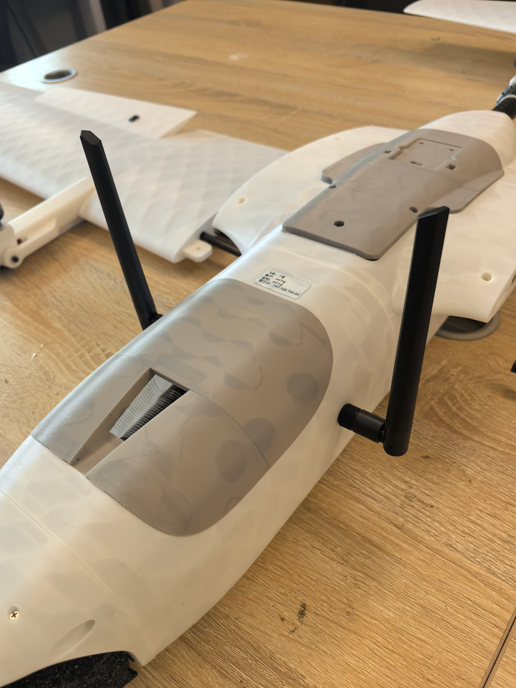
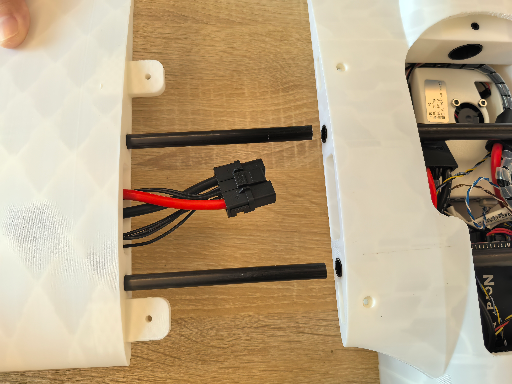
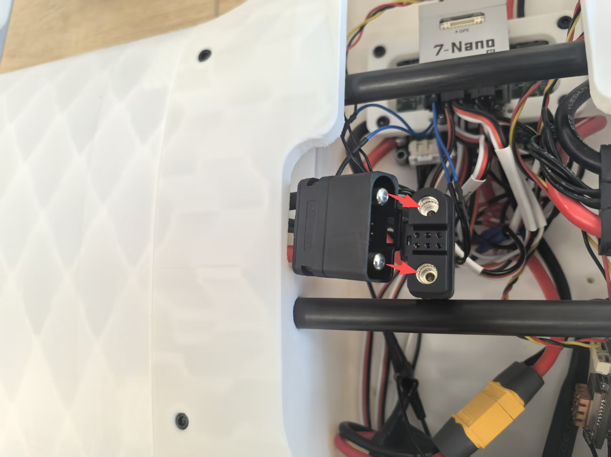
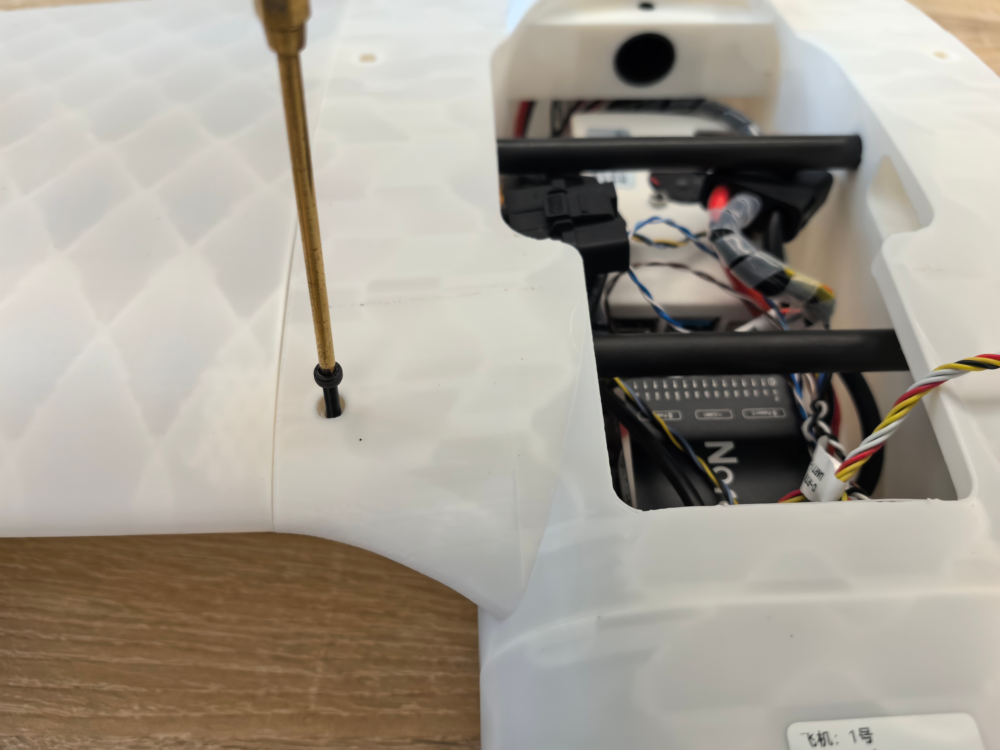

# 开箱组装测试

## 开箱

* 检查产品包装是否完整
* 检查产品包装是否有损坏
* 检查产品包装是否有缺失

## 说明三层泡沫包含的东西

### 第一层泡沫

* 缓冲泡绵

### 第二层泡沫

1. 无人机发货测试清单
2. 无人机桨叶
3. 备用螺丝螺母
4. 机翼固定螺丝
5. 一对机翼

*第二层泡沫中的物品布局*

* 注意无人机尾翼与泡沫方向，避免损坏尾翼

*无人机发货测试清单*

*无人机桨叶四对*

*备用螺丝螺母*

*机翼螺丝*

*无人机机翼一对(注意一手拿住电机，一手拿住机翼，抬出机翼，避免机翼过多受力造成损坏)*

 

### 第三层泡沫

1.遥控器

2.RTK蘑菇头天线

3.RTK地面端

4.飞控配件盒

5.动力电池*2

6.动力电池充电器

*第三层泡沫中的物品布局*

*无人机遥控器*
打开控包为遥控器主体，控包隔层内含充电插头等配件

*RTK蘑菇头天线*

*RTK地面端模块*
内含地面端模块主体及馈线配件等

*飞控配件盒*

*9900mah无人机动力电池 2块*

*动力电池充电器*

*无人机机身主体*

## 组装测试

### *机身主体组装*

* 打开头部舱盖取出G12天空端天线和RTK天空端天线，并将天线装好

* 完成安装如下图

* 将机翼碳管对齐插入机身主碳管，注意将快拆头事先穿入机身。

* 将快拆头接入就近的快拆头接口即可

* 最后将机翼插装到位，目测确认螺丝孔对齐贯通、无偏移，使用H2.5内六角螺丝刀将机翼固定螺丝拧入对应孔位即完成组装

