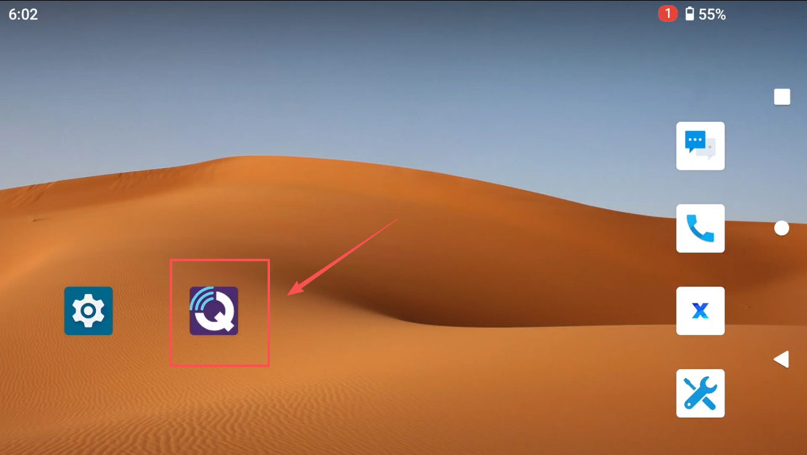

# RTK基站配置

## G12链路RTK基站配置

### 方式一：使用G12遥控器直连RTK基站

1. 如图19号所示的Type-C接口，将G12遥控器直接连接到RTK基站上。

2. G12遥控器上，打开QGC地面站软件。

3. QGC地面站软件回自动识别并转发RTK数据。

### 方式二：使用G12链路的WIFI热点连接RTK基站

1. 电脑连接到G12链路的WIFI热点。
2. 打开QGC地面站软件。
3. QGC地面站软件回自动识别并转发RTK数据。

* 出现方卫星的这个图标，检查 Accuracy 是否在 2 米以内，在 2 米以内说明定位良好可使用RTK定位。

## HM30链路RTK基站配置

### 只能通过电脑连接RTK基站

* 将RTK基站的USB接口连接到电脑上。

* 出现方卫星的这个图标，检查 Accuracy 是否在 2 米以内，在 2 米以内说明定位良好可使用RTK定位。

## MK32链路RTK基站配置

