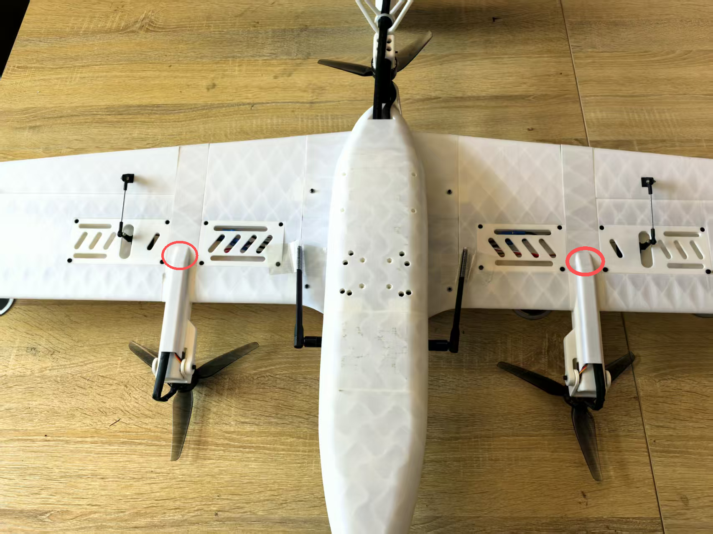
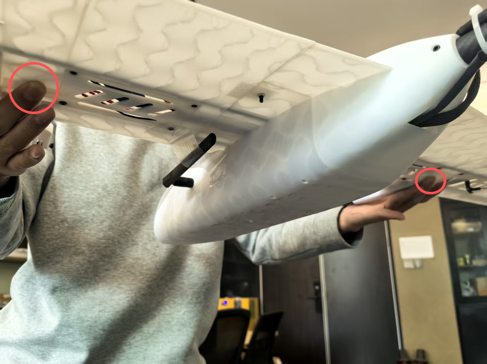
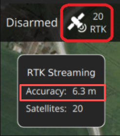

# **快速飞行**

* 本页面为快速飞行的相关内容，作为飞行前注意事项检查使用，不作为详细教程
* 详细教程请参考其他部分

## **重心配平说明**

### 正确的重心位置

对于 SwiftWing S7 VTOL 无人机，推荐的重心位置为：

- **固定翼模式**：重心应位于机翼前缘后约 25%-30% 机翼弦长处
- **多旋翼模式**：重心应位于几何中心附近，确保各电机负载均匀

* 注意：出厂前已配置好重心位置，无需额外操作。如果添加其他设备，需要重新考虑重心

### 配平注意事项

- **重量分布**：确保所有设备和载荷均匀分布，避免单侧偏重
- **电池位置**：电池通常是无人机的主要重量来源，其位置对重心影响显著

* 下图为正确的重心位置示意图

* 双手支撑重心位置，机头由水平方向变为微微前倾即可

## **一、地面测试前的设备准备**

* 需准备以下设备：
  1. 遥控器
  2. 思翼通讯链路地面端
  3. elrs接收机
  4. 思翼通讯链路网线
  5. 8800毫安动力电池
  6. RTK基站
  7. 笔记本电脑

## **二、起飞前地面传感器校准**

* 传感器校准说明：
  1. 校准罗盘：新场地建议校准，旧场地没有报错提示可不校准
  2. 校准空速：飞行前校准
  3. 其他传感器：没有报错提示，可不校准

### 开始传感器校准

* 在QGC软件中点击传感器设置，点击罗盘，点击OK，开始校准罗盘

* 红色方框变成黄色后，说明检测到当前姿态，即可逆时针转动无人机，至完成当前姿态校准，然后依次完成其余姿态校准。

* 校准完成后需拔电重启飞行器，才能正常使用（若无罗盘报错提示则可不用校准）

* 进行空速的校准前，需要先用手挡住空速管，然后点击空速校准

吹气注意事项
1、深吸一口气，吹气方向正对空速管的动压孔；
2、距离空速管的动压孔 3-5cm，均匀、缓慢、持续向前吹气；
3、如果失败可以多次尝试。
*[cal] calibration started: airspeed*     校准已启动：空速
*[cal] Ensure sensor is not measuring wind*     确保传感器未在测量风速

* *[cal] Blow into front pitot without touching*    出现语音提示，对空速管吹气
* *[cal] calibration done: airspeed*     校准已完成：空速

## **三、起飞前舵面偏转测试说明**

- 起飞前需确认固定翼模式下舵面的偏转方向正确，避免出现控制出错。一般情况下，飞机整机安装完成后，且未拆装机体、未更改遥控器配置或飞控的 actuator 参数，无需重复测试。**但如果发生以下任一情况，必须重新进行地面测试**：
  - 飞控重新接线；
  - 修改遥控器相关配置；
  - 调整飞控中 actuator 相关参数。

 **倾转电机摆动方向检测（旋翼模式）**

* 油门保持最低，在旋翼的自稳模式下，解锁无人机，左右推动偏航杆，观察左右倾转电机是否按照控制方向同步摆动，确保其动作方向正确。

- **固定翼模式切换检测**
  * 油门保持最低，在旋翼的自稳模式下，解锁无人机，然后拨动飞行模式转换开关，切换至“固定翼模式”。此时，两个倾转电机将快速切换至水平。

- **舵面动作检测（固定翼模式）**

  * 切换至固定翼模式后，将油门收至0位。维持“自稳模式”，操作遥控器检查各舵面动作：
    * 模拟飞机飞行姿态，观察自稳模式下舵面是否有让飞机姿态能够回中的趋势

* 同理，机头上翘，舵面应为向下。

- 左右打副翼杆，检查副翼是否正确偏转；

* 上下打俯仰杆，检查升降舵动作是否正确；

* 左右打偏航杆，检查方向舵是否响应正常。

### 四、机载offboard检测（固定翼模式）

* 在地面站电脑上，使用vscode ssh连接至树莓派机载电脑
* 开启一个终端，输入 ``roslaunch mavros swing.launch``以启动mavros连接；

- 再开启一个新终端，输入 ``rosrun uav_controller actuator_test.py``启动机载舵面测试节点，根据终端中输出的舵面偏转指令，查看各舵面偏转情况是否正确。

* 在旋翼的自稳模式下切换到固定翼的自稳模式，再切换飞行模式为 **OFFBOARD** 模式，即可开启机载offboard控制
* 开启机载offboard控制后，飞控即可响应机载计算机发送的控制指令
* 观察副翼，尾翼的运动趋势（因舵面积分原因，可能出现舵面未归中导致舵面摆动幅度较小的情况）

- **检测完成**

  * 检查无误后，先手动拨动遥控器退出 **OFFBOARD** 模式，油门遥感依旧在最低位置，拨动飞行转换按钮，切回多旋翼模式，待倾转电机复位至垂直方向后，将拨杆拨至锁定按钮。
  * 然后断开机载运行程序

## **五、RTK定位数据检查**

* C-RTK GPS图标变为白色，QGroundControl开始将位置数据传输到飞行器
* 等待Accuracy数值小于2m，说明定位收敛效果满足起飞精度

## **六、飞行准备**

1. 确认电池电量充足
2. 检查电机转向无误（左前顺时针，右前和尾电机逆时针），注意螺旋桨安装方向上与电机转向同向的螺旋桨，螺母一定要固定死
3. 用纤维胶带将飞机舱盖粘好防止意外脱落

* 如果无人机上电的位置不是起飞点，则需要手动重启融合定位，输入 ekf2 stop，然后再输入 ekf2 start，等待定位数据重置为0

## 七、启动程序

1. 启动mavros程序，输入 *roslaunch mavros swing.launch*

2. 启动控制程序，此处以绕圆控制程序举例，输入：`roslaunch single_demo plane_circle_track.launch`

* 程序启动完成后，即可准备解锁起飞到合适位置切入 OFFBOARD 模式。

## 八、解锁起飞

* 检查无人机重心是否正确，参考最前方的重心配平说明
* 重心正确无误后，在旋翼的定点模式下解锁起飞

* 控制程序正常运行，飞手控制无人机飞到合适的高度和朝向,就可以切入 OFFBOARD 模式，响应控制程序的指令了,切入 OFFBOARD 模式后，飞手持续关注无人机飞行状态即可，可以持续观察右边控制指令和左边飞行轨迹

## 九、切换控制程序

* 上一次的飞行任务完成后，飞手退出 OFFBOARD 模式，切回定点模式，手动接管飞行
* 一定要等飞手切出offboard模式后，再终止控制程序，当出现done字样时，说明控制程序已终止

* 基于上一步启动了mavros程序，后续启动控制程序即可。如果断开了mavros程序，需要重新启动mavros程序，再启动控制程序。

2. 启动下一程序，此处以绕飞斜圆举例，输入：`roslaunch single_demo plane_circle_track.launch`

* 上一次的飞行任务完成后，飞手退出 OFFBOARD 模式，切回定点模式，手动接管飞行
* 一定要等飞手切出offboard模式后，再终止控制程序，当出现done字样时，说明控制程序已终止

3. 启动下一程序绕飞八字，输入：`roslaunch single_demo plane_poly_track.launch`

* 无人机按照程序正常飞行，完成程序控制飞行后，即可手动接管,飞手手动控制在固定翼模式下降低高度和速度,在朝向逆风的方向，切换到旋翼模式降落即可,完成飞行任务并降落上锁后，即可断开程序和无人机电源

## 十、整理设备

1. 先断开无人机电源
2. 关闭遥控器
3. 关闭地面电脑设备
4. 打包收拾设备即可完成飞行任务