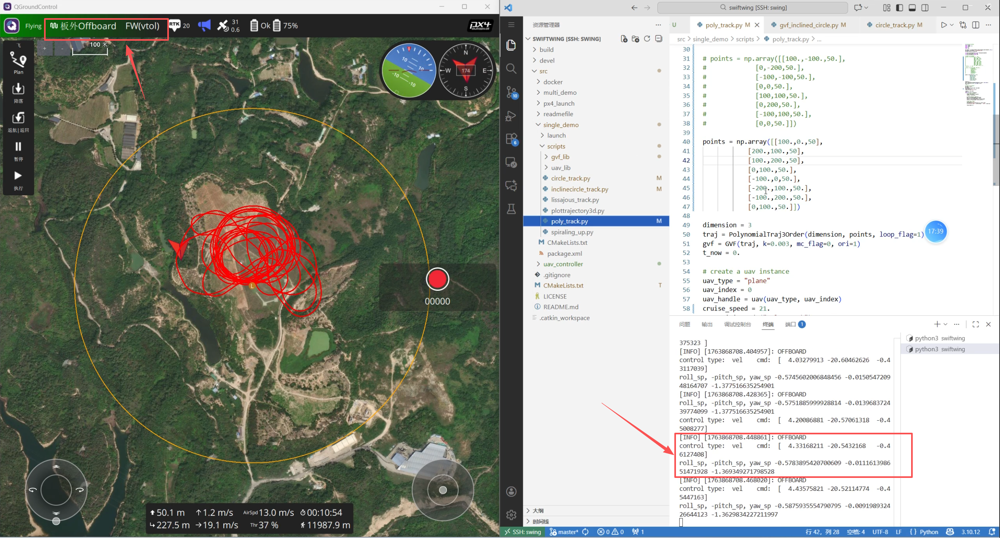

# 多项式轨迹 Demo

本教程介绍如何配置多项式轨迹点、启动机载控制程序，并完成固定翼模式下的自主多项式轨迹飞行测试。

## 1. 配置多项式轨迹

### 1.1 设置路径点

多项式轨迹根据输入的路径点生成。Demo 中使用的路径点数组如下：

```python
points = np.array([
    [100., -100., 50],
    [0, -200, 50],
    [-100, -100, 50],
    [0, 0, 50],
    [100, 100, 50],
    [0, 200, 50],
    [-100, 100, 50],
    [0, 0, 50]
])
```

`points` 是一个 $n \times 3$ 的数组，其中 $n$ 为路径点数量。

### 1.2 设置轨迹闭合方式

通过以下代码创建三阶多项式轨迹：

```python
traj = PolynomialTraj3Order(dimension, points, loop_flag=1)
```

当 `loop_flag=1` 时，程序会自动连接 `points` 数组的首尾两点，形成封闭曲线路径。

> **测试提示：** 自定义路径点后，应先在仿真环境中检查轨迹形状和飞行效果，再进行实机测试。

## 2. 启动机载程序

### 2.1 连接机载电脑

使用 VS Code 通过 SSH 远程连接机载电脑，然后进入程序目录：

```shell
cd /home/program/swiftwing
```

### 2.2 启动 MAVROS

打开第一个终端，运行以下命令启动 MAVROS 连接：

```shell
roslaunch mavros swing.launch
```

### 2.3 启动多项式轨迹跟踪节点

保持 MAVROS 终端运行，再打开一个终端，启动多项式轨迹跟踪控制节点：

```shell
roslaunch single_demo plane_poly_track.launch
```

## 3. 确认飞控连接状态

启动节点后，需要等待程序获取无人机的飞行模式。只有终端中显示 `POSCTL`，才表示通信链路已经建立，可以继续准备切换至 Offboard 模式。

### 3.1 尚未获取飞行模式

如果终端尚未显示无人机模式，请继续等待，不要立即切换至 Offboard 模式。

- 树莓派受算力限制，获取飞行模式通常需要等待一段时间；
- NVIDIA Jetson 算力较高，通常可以更快获取飞行模式。


*终端尚未获取无人机飞行模式。*

### 3.2 已获取飞行模式

终端显示 `POSCTL` 后，表示程序已经能够获取无人机的飞行模式。此时应先调整好无人机的位置和朝向，再准备切换至 Offboard 模式。


*终端显示 `POSCTL`，通信链路已建立。*

### 3.3 切换至 Offboard 模式

切换至 Offboard 模式后，飞行器开始响应机载程序指令，并执行多项式轨迹跟踪控制。



*飞行器进入 Offboard 模式并开始执行多项式轨迹。*

## 4. 飞手操作流程

1. **垂直起飞：** 在多旋翼模式下解锁并垂直起飞，起飞时机头应朝向逆风方向。
2. **爬升至安全高度：** 飞行至约 30–40 米高度，确认前方无遮挡、机头方向开阔，再准备切换飞行模式。
3. **切换至固定翼模式：** 拨动飞行模式切换开关，将飞行器由多旋翼模式切换为固定翼模式。
4. **调整位置和航向：** 进入固定翼模式后，根据飞控中设定的飞行方向微调航向。切换至 Offboard 模式后，飞机将首先跟踪第一个路径点，因此切换前应使实际飞行方向尽量接近期望轨迹方向。
5. **开始自主飞行：** 确认飞行姿态平稳后，切换至 Offboard 模式，开始执行自主多项式轨迹（八字）飞行任务。
6. **结束测试并返航：** 使用遥控器将飞机飞回起飞点附近，并将航向调整至逆风方向。待飞机姿态平稳且机头前方无遮挡时，将飞行模式由固定翼切换回多旋翼模式。
