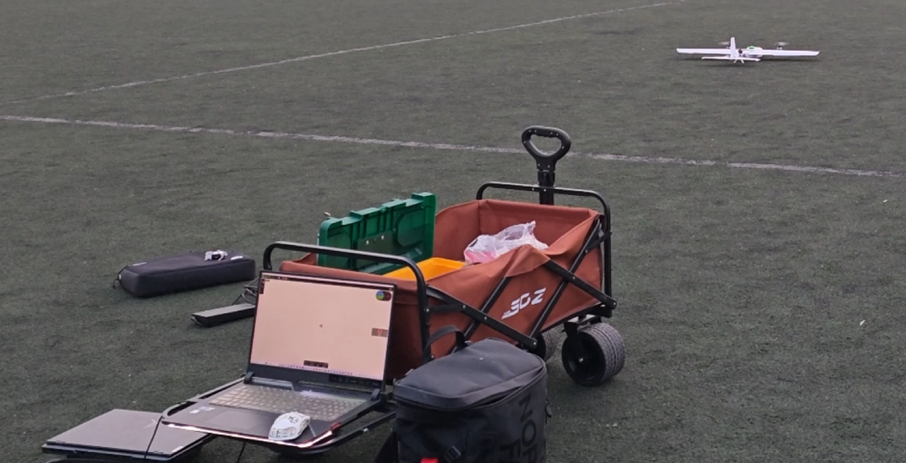
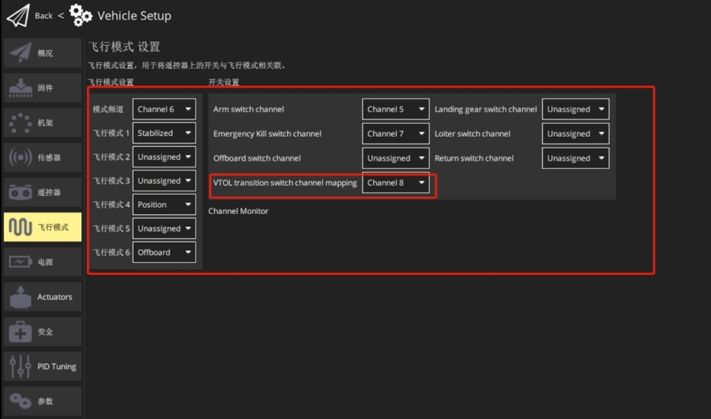
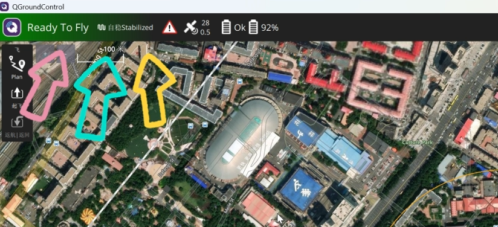
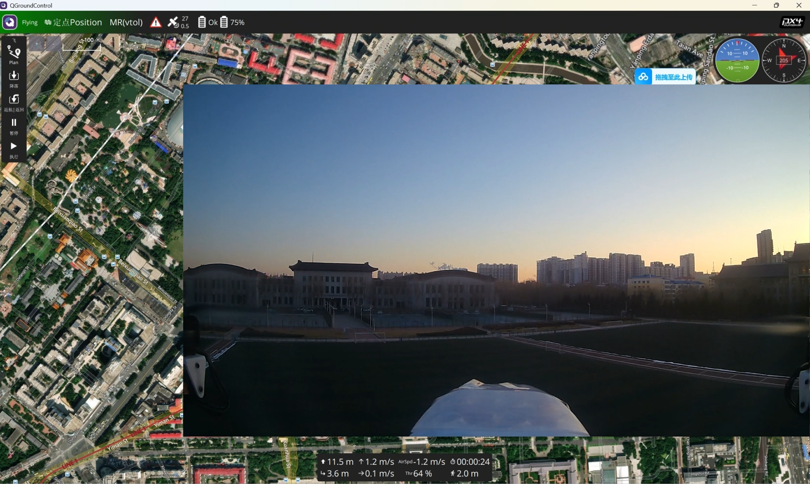
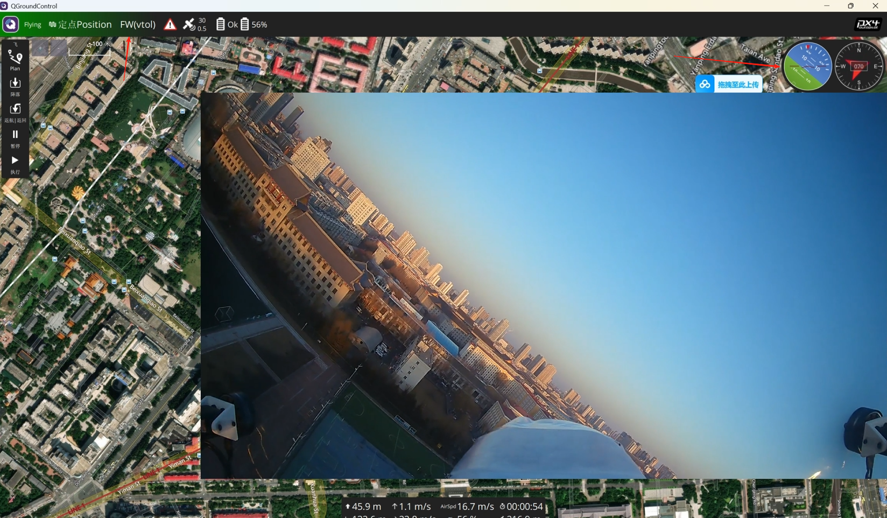
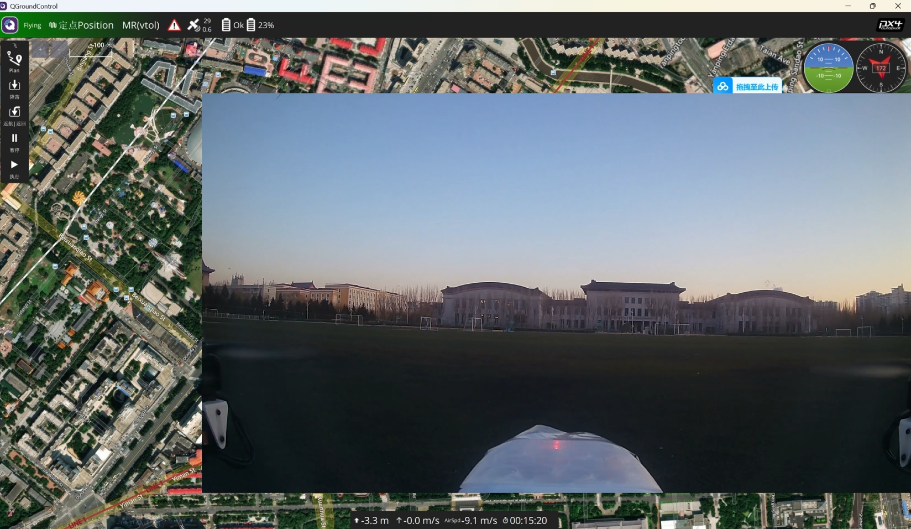

# 手动飞行介绍

本教程介绍 SwiftWing S7 VTOL 从多旋翼起飞、切换至固定翼巡航，再切换回多旋翼并完成降落的基本手动飞行流程。

## 1. 飞行前准备

开始飞行前，请先完成前述硬件和软件准备，并确认飞行场地满足测试要求。

*完成飞行前的硬件和软件准备。*

### 1.1 熟悉遥控器通道

首次飞行前，飞手应熟悉遥控器各通道、飞行模式开关及 VTOL 切换通道的功能。

*确认遥控器通道及模式切换功能。*

### 1.2 检查飞行器状态

检查 S7 VTOL 的飞行状态。界面显示 `Ready To Fly` 时，表示当前状态正常，可以继续准备起飞。

*飞行器状态显示 `Ready To Fly`。*

## 2. 多旋翼模式起飞

1. 将飞行模式切换至多旋翼定点模式。
2. 解锁飞行器，并使用遥控器进行手动飞行。
3. 确认飞行器响应正常、能够稳定悬停。

> **操作提示：** 首次飞行前，应提前熟悉多旋翼定点模式下的操控方式。

*在多旋翼定点模式下解锁并起飞。*

## 3. 从多旋翼切换至固定翼

### 3.1 爬升并准备切换

在多旋翼自稳模式下手动飞行至约 40 米高度，并将机头调整至逆风方向。确认前方空域开阔后，拨动 VTOL 切换通道：

1. 前部两个倾转舵机控制电机向前倾斜；
2. 飞行器开始向前加速；
3. 飞行器逐步由多旋翼状态转换为固定翼状态。

*飞行器开始由多旋翼模式向固定翼模式过渡。*

### 3.2 确认倾转完成

倾转完成后：

- 飞行模式由 `MR (VTOL)` 变为 `FW (VTOL)`；
- 前部两个倾转电机完全转向前方。

*倾转完成后，飞行器进入 `FW (VTOL)` 模式。*

## 4. 固定翼模式手动飞行

进入固定翼定点模式后，飞手通过遥控器手动控制飞行器，并持续观察飞行姿态、航向和周围空域。

*在固定翼模式下进行手动操控。*

飞手可根据个人操控习惯和场地条件调整固定翼飞行轨迹。

*固定翼模式下的手动飞行过程。*

## 5. 从固定翼切换回多旋翼

### 5.1 降低高度和速度

在固定翼定点模式下逐步降低飞行高度和速度，并飞向降落区域。原测试流程在约 22 米高度、13 米每秒速度下拨动 VTOL 切换通道。

*降低高度和速度，准备切换回多旋翼模式。*

### 5.2 完成反向倾转

切换过程中：

- 飞行模式由 `FW (VTOL)` 变为 `MR (VTOL)`；
- 前部两个倾转电机由完全向前逐步转为向上。

*飞行器由固定翼状态转换回多旋翼状态。*

## 6. 降落并上锁

1. 在多旋翼定点模式下手动控制飞行器进入降落区域。
2. 平稳降低高度，控制飞行器接触地面。
3. 接地后持续拉低油门，等待电机上锁。

*飞行器降落并完成电机上锁。*
