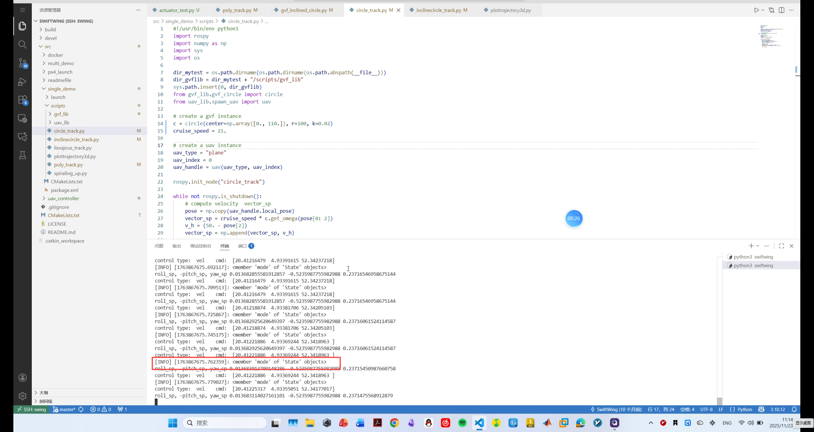
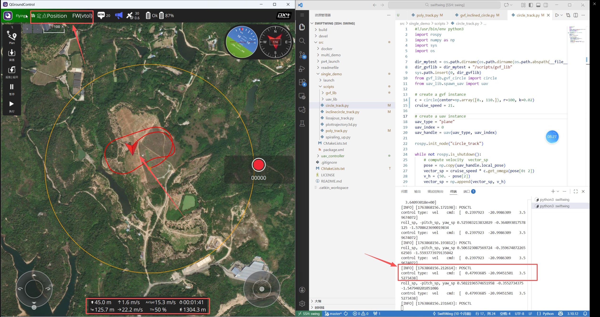
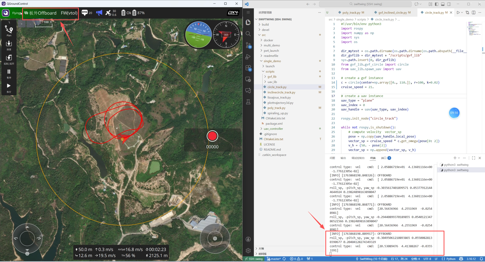

# 绕圆功能 Demo

本教程介绍如何配置绕圆轨迹参数、启动机载控制程序，并完成固定翼模式下的自主绕圆飞行测试。

## 1. 配置绕圆轨迹

### 1.1 设置绕圆方向

在 `gvf_circle.py` 文件中，`circle` 类的 `get_tau(self, pos, rotate="ccw")` 函数通过 `rotate` 参数设置绕圆方向。以下方向均以地面站俯视视角为准：

| `rotate` 参数 | 绕圆方向 |
| --- | --- |
| `"cw"` | 顺时针 |
| `"ccw"` | 逆时针 |

### 1.2 设置圆心、半径和增益

在 `circle_track.py` 文件中，通过以下代码实例化圆轨迹生成器：

```python
c = circle(center=np.array([0., 0.]), r=100, k=0.02)
```

各参数含义如下：

| 参数 | 说明 |
| --- | --- |
| `center` | 圆轨迹的圆心坐标 |
| `r` | 圆轨迹的半径 |
| `k` | 向量场增益系数 |

### 1.3 检查最小转弯半径

为了确保轨迹半径设置合理，建议满足以下最小转弯半径条件：

<div class="math-display">
\[
\left\{
\begin{aligned}
R_{\min} &= \frac{V^2}{a_{\max}} \\
a_{\max} &= \tan(\phi_{\max}) \cdot g
\end{aligned}
\right.
\]
</div>

其中：

- $V$ 为飞行器或机器人当前速度；
- $a_{\max}$ 为最大允许横向加速度；
- $\phi_{\max}$ 为最大允许滚转角；
- $g$ 为重力加速度。

机载代码中，姿态滚转角最大值设定为 $45^\circ$。

## 2. 启动机载程序

### 2.1 连接机载电脑

使用 VS Code 通过 SSH 远程连接机载电脑，然后进入程序目录：

```shell
cd /home/program/swiftwing
```

### 2.2 启动 MAVROS

打开第一个终端，运行以下命令启动 MAVROS 连接：

```shell
roslaunch mavros swing.launch
```

### 2.3 启动圆轨迹跟踪节点

保持 MAVROS 终端运行，再打开一个终端，启动圆轨迹跟踪控制节点：

```shell
roslaunch single_demo plane_circle_track.launch
```

## 3. 确认飞控连接状态

启动节点后，需要等待程序获取无人机的飞行模式。只有终端中显示 `POSCTL`，才表示通信链路已经建立，可以继续准备切换至 Offboard 模式。

### 3.1 尚未获取飞行模式

如果终端尚未显示无人机模式，请继续等待，不要立即切换至 Offboard 模式。

- 树莓派受算力限制，获取飞行模式通常需要等待一段时间；
- NVIDIA Jetson 算力较高，通常可以更快获取飞行模式。



*终端尚未获取无人机飞行模式。*

### 3.2 已获取飞行模式

终端显示 `POSCTL` 后，表示程序已经能够获取无人机的飞行模式。此时应先调整好无人机的位置和朝向，再准备切换至 Offboard 模式。



*终端显示 `POSCTL`，通信链路已建立。*

### 3.3 切换至 Offboard 模式

切换至 Offboard 模式后，飞行器开始响应机载程序指令，并执行圆轨迹跟踪控制。



*飞行器进入 Offboard 模式并开始响应机载控制程序。*

## 4. 飞手操作流程

1. **垂直起飞：** 在多旋翼模式下解锁并垂直起飞，起飞时机头应朝向逆风方向。
2. **爬升至安全高度：** 飞行至约 30–40 米高度，确认前方无遮挡、机头方向开阔，再准备切换飞行模式。
3. **切换至固定翼模式：** 拨动飞行模式切换开关，将飞行器由多旋翼模式切换为固定翼模式。
4. **调整实际航向：** 进入固定翼模式后，根据飞控中设定的飞行方向，使用遥控器微调航向，使飞机实际飞行方向与自主控制的预期方向尽量保持一致。
5. **开始自主绕圆：** 确认飞行姿态平稳后，切换至 Offboard 模式，开始执行自主圆轨迹飞行任务。
6. **结束测试并返航：** 使用遥控器将飞机飞回起飞点附近，并将航向调整至逆风方向。待飞机姿态平稳且机头前方无遮挡时，将飞行模式由固定翼切换回多旋翼模式。
