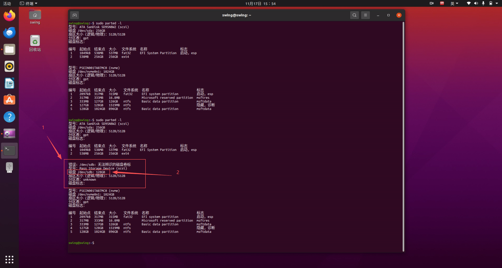
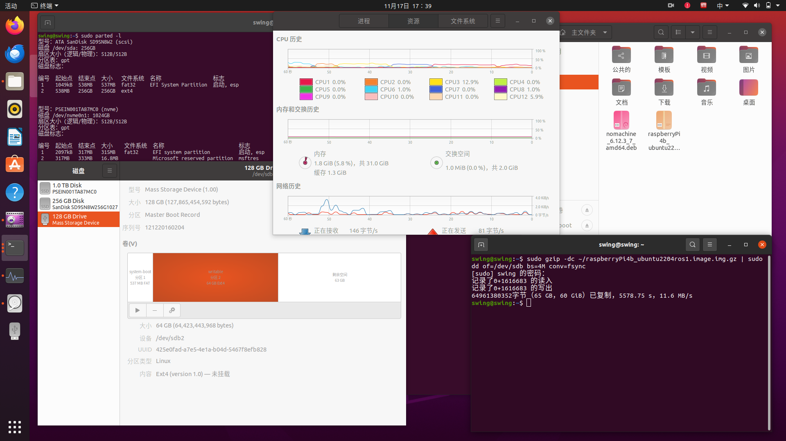
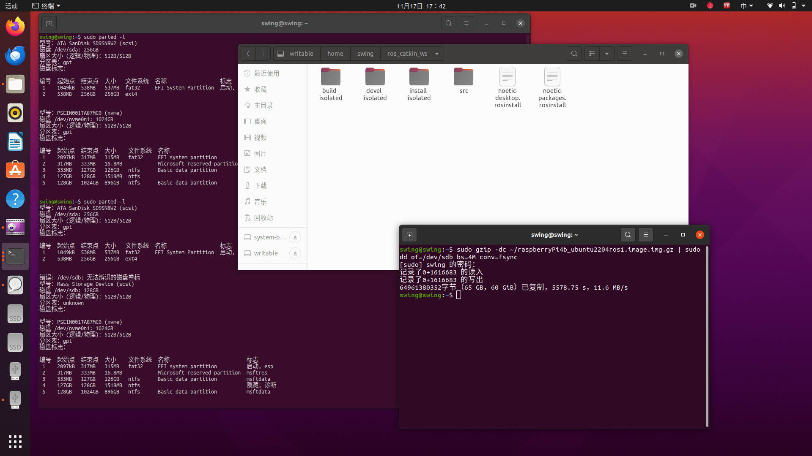

# 镜像备份与恢复

本教程介绍在 Ubuntu 系统下备份和恢复 SD 卡镜像的两种方法：

- **方法一：** 将 SD 卡备份为压缩镜像文件，并在需要时将镜像恢复到另一张 SD 卡；
- **方法二：** 使用 `dd` 命令在两张 SD 卡或磁盘之间直接复制全部数据。

> **数据安全警告：**
>
> 1. `dd` 会直接读写整个块设备。源设备与目标设备一旦填写反向，可能立即覆盖并清除重要数据。
> 2. 执行命令前，必须通过设备容量、分区信息和插拔前后变化，至少两次确认设备名称。
> 3. 不要直接照抄文中的 `/dev/sdb`、`/dev/sdc` 或 `/dev/sdd`；这些名称仅为示例，应替换为当前电脑实际识别到的设备。
> 4. 执行任何备份或恢复操作前，应先备份电脑和 SD 卡中的重要数据。

## 1. 方法选择

| 方法 | 适用场景 | 注意事项 |
| --- | --- | --- |
| 压缩镜像文件 | 需要长期保存、传输或归档镜像 | 恢复目标 SD 卡容量应不小于原 SD 卡 |
| 设备直接复制 | 已同时连接源 SD 卡和目标 SD 卡 | 会直接覆盖目标设备全部数据 |

通常建议使用方法二快速完成设备间复制；如果需要长期保存镜像文件，则使用方法一。

## 2. 方法一：备份为压缩镜像

### 2.1 准备工作

准备以下设备和环境：

1. 需要备份的 SD 卡；
2. SD 卡读卡器；
3. 安装 Ubuntu 18.04 或更高版本的电脑；
4. 电脑剩余磁盘空间大于 20 GB。

### 2.2 识别 SD 卡设备

**步骤 1：记录插卡前的设备列表**

在插入 SD 卡前打开终端，运行：

```shell
sudo parted -l
```


**步骤 2：连接 SD 卡**

将 SD 卡插入读卡器，再将读卡器连接至电脑。

**步骤 3：再次查看设备列表**

再次运行：

```shell
sudo parted -l
```


**步骤 4：确认 SD 卡设备**

对比插卡前后的设备列表，根据容量和分区信息确认 SD 卡设备。以下示例中设备名称为 `/dev/sdb`。


### 2.3 创建压缩镜像

**步骤 1：确认保存位置**

确认镜像保存目录和文件名。


**步骤 2：执行备份命令**

执行以下命令开始备份：

```shell
sudo dd if=/dev/sdb conv=sync,noerror status=progress bs=64K | gzip -c > ~/raspberryPi.image.img.gz
```

命令中的关键参数：

| 参数 | 说明 |
| --- | --- |
| `if=/dev/sdb` | 作为读取来源的 SD 卡设备 |
| `~/` | 镜像文件保存目录 |
| `raspberryPi.image.img.gz` | 生成的压缩镜像文件名 |
| `status=progress` | 显示复制进度 |


**步骤 3：等待备份完成**

等待命令执行完毕。终端重新出现命令提示符后，检查目标目录中是否已经生成镜像文件。


## 3. 从压缩镜像恢复 SD 卡

### 3.1 准备目标 SD 卡

- 提前格式化目标 SD 卡；
- 目标 SD 卡容量应与原 SD 卡相同或更大。

### 3.2 识别目标设备

**步骤 1：记录插卡前的设备列表**

插入目标 SD 卡前，运行：

```shell
sudo parted -l
```


**步骤 2：连接并识别目标 SD 卡**

将目标 SD 卡连接至电脑后，再次运行 `sudo parted -l`。


**步骤 3：确认目标设备**

根据容量和分区信息确认目标 SD 卡设备。以下示例中设备名称为 `/dev/sdb`。



### 3.3 写入镜像

**步骤 1：确认镜像文件**

确认压缩镜像文件的路径和名称。


**步骤 2：执行恢复命令**

执行以下命令，将镜像写入目标 SD 卡：

```shell
sudo gzip -dc ~/raspberryPi4b_ubuntu2204ros1.image.img.gz | sudo dd of=/dev/sdb bs=4M conv=fsync status=progress
```

命令中的关键参数：

| 参数 | 说明 |
| --- | --- |
| `~/raspberryPi4b_ubuntu2204ros1.image.img.gz` | 待恢复的压缩镜像文件 |
| `of=/dev/sdb` | 将被覆盖写入的目标 SD 卡设备 |
| `bs=4M` | 使用 4 MB 块大小写入 |
| `conv=fsync` | 完成前将数据同步写入设备 |


**步骤 3：等待恢复完成**

等待命令执行完毕，再安全弹出 SD 卡。





## 4. 方法二：在两个设备之间直接复制

方法二使用 `dd` 将源设备的全部数据直接复制到目标设备。以下通用命令用于说明参数结构：

```shell
sudo dd if=/dev/source_device of=/dev/target_device bs=2M conv=sync,noerror status=progress
```

| 参数 | 说明 |
| --- | --- |
| `sudo` | 以超级用户权限执行命令 |
| `dd` | 进行块设备级数据复制 |
| `if=` | 输入设备，即需要备份或复制的源设备 |
| `of=` | 输出设备，即将被覆盖的目标设备 |
| `bs=2M` | 每次以 2 MB 为单位读写 |
| `conv=sync,noerror` | 遇到读取错误时继续复制，并保持块大小对齐 |
| `status=progress` | 显示实时复制进度 |

### 4.1 识别源设备和目标设备

1. 连接 SD 卡前运行 `sudo parted -l`；
2. 依次连接源 SD 卡和目标 SD 卡；
3. 再次运行 `sudo parted -l`；
4. 根据容量、分区信息和插入顺序，确认源设备与目标设备。

以下示例中：

- `/dev/sdc` 是包含原始数据的源 SD 卡；
- `/dev/sdd` 是将被完全覆盖的目标 SD 卡。


### 4.2 再次核对设备

执行命令前，确认 `if=` 后是源设备，`of=` 后是目标设备。


### 4.3 开始复制

确认设备名称无误后，执行：

```shell
sudo dd if=/dev/sdc of=/dev/sdd bs=2M conv=sync,noerror status=progress
```


### 4.4 等待复制完成

复制过程中不要拔出任一 SD 卡。命令执行结束后，再安全弹出设备。


